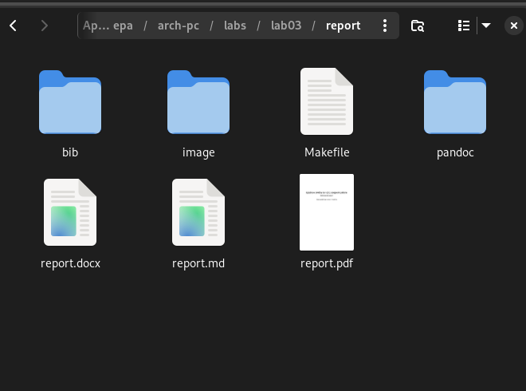

---
## Front matter
title: "Шаблон отчёта по лабораторной работе №3"
subtitle: "Простейший вариант"
author: "Раднаев Ардан Баирович"

## Generic otions
lang: ru-RU
toc-title: "Содержание"

## Bibliography
bibliography: bib/cite.bib
csl: pandoc/csl/gost-r-7-0-5-2008-numeric.csl

## Pdf output format
toc: true # Table of contents
toc-depth: 2
lof: true # List of figures
lot: true # List of tables
fontsize: 12pt
linestretch: 1.5
papersize: a4
documentclass: scrreprt
## I18n polyglossia
polyglossia-lang:
  name: russian
  options:
	- spelling=modern
	- babelshorthands=true
polyglossia-otherlangs:
  name: english
## I18n babel
babel-lang: russian
babel-otherlangs: english
## Fonts
mainfont: IBM Plex Serif
romanfont: IBM Plex Serif
sansfont: IBM Plex Sans
mathfont: STIX Two Math
mainfontoptions: Ligatures=Common,Ligatures=TeX,Scale=0.94
romanfontoptions: Ligatures=Common,Ligatures=TeX,Scale=0.94
sansfontoptions: Ligatures=Common,Ligatures=TeX,Scale=MatchLowercase,Scale=0.94
monofontoptions: Scale=MatchLowercase,Scale=0.94,FakeStretch=0.9
mathfontoptions:
## Biblatex
biblatex: true
biblio-style: "gost-numeric"
biblatexoptions:
  - parentracker=true
  - backend=biber
  - hyperref=auto
  - language=auto
  - autolang=other*
  - citestyle=gost-numeric
## Pandoc-crossref LaTeX customization
figureTitle: "Рис."
tableTitle: "Таблица"
listingTitle: "Листинг"
lofTitle: "Список иллюстраций"
lotTitle: "Список таблиц"
lolTitle: "Листинги"
## Misc options
indent: true
header-includes:
  - \usepackage{indentfirst}
  - \usepackage{float} # keep figures where there are in the text
  - \floatplacement{figure}{H} # keep figures where there are in the text
---

# Цель работы

Целью работы является освоение процедуры оформления отчетов с помощью легковесного языка разметки Markdown.

# Задание

1. Заполнение отчета по выполнению лабораторной работы №3 с помощью языка разметки Markdown.

2. Задание для самостоятельной работы.

# Теоретическое введение

Чтобы создать заголовок, используйте знак #, например:
# This is heading 1
## This is heading 2
### This is heading 3
#### This is heading 4
Чтобы задать для текста полужирное начертание, заключите его в двойные звездочки:
This text is **bold**.
Чтобы задать для текста курсивное начертание, заключите его в одинарные звездочки:
This text is *italic*.
Чтобы задать для текста полужирное и курсивное начертание, заключите его в тройные
звездочки:
This is text is both ***bold and italic***.
Блоки цитирования создаются с помощью символа >:
> The drought had lasted now for ten million years, and the reign of the
terrible lizards had long since ended. Here on the Equator, in the
continent which would one day be known as Africa, the battle for existence
had reached a new climax of ferocity, and the victor was not yet in sight.
In this barren and desiccated land, only the small or the swift or the
fierce could flourish, or even hope to survive.
↪
↪
↪
↪
↪
Упорядоченный список можно отформатировать с помощью соответствующих цифр

1. First instruction
	1. Sub-instruction
	1. Sub-instruction
1. Second instruction
Чтобы вложить один список в другой, добавьте отступ для элементов дочернего списка:
1. 	First instruction
1. 	Second instruction
1. 	Third instruction
Неупорядоченный (маркированный) список можно отформатировать с помощью звездо-
чек или тире:
* List item 1
* List item 2
* List item 3
Чтобы вложить один список в другой, добавьте отступ для элементов дочернего списка:
- List item 1
- List item A
- List item B
- List item 2
Синтаксис Markdown для встроенной ссылки состоит из части [link text], представляю-
щей текст гиперссылки, и части (file-name.md) – URL-адреса или имени файла, на который
дается ссылка:
[link text](file-name.md)
или
[link text](http://example.com/ "Необязательная подсказка")
Markdown поддерживает как встраивание фрагментов кода в предложение, так и их разме-
щение между предложениями в виде отдельных огражденных блоков. Огражденные блоки
кода — это простой способ выделить синтаксис для фрагментов кода. Общий формат ограж-
денных блоков кода:
``` language
your code goes in here
```

# Выполнение лабораторной работы

ППри выполнении лабораторной работы на своей технике необходимо установить следую-
щее ПО:
• TeX Live (https://www.tug.org/texlive/) последней версии.
• Pandoc (https://pandoc.org/) 

1. Откройте терминал
2. Перейдите в каталог курса сформированный при выполнении лабораторной работы
№2:
	cd ~/work/study/2023-2024/"Архитектура компьютера"/arch-pc/
	
Обновите локальный репозиторий, скачав изменения из удаленного репозитория с помо-
щью команды
	git pull
	
3. Перейдите в каталог с шаблоном отчета по лабораторной работе № 3
	cd ~/work/study/2023-2024/"Архитектура компьютера"/arch-pc/labs/lab03/report
	
4. Проведите компиляцию шаблона с использованием Makefile. Для этого введите ко-
манду
	make


{#fig:fig1 width=70% }

При успешной компиляции должны сгенерироваться файлы report.pdf и report.docx.
Откройте и проверьте корректность полученных файлов.

{#fig:fig2 width=70% }

5. Удалите полученный файлы с использованием Makefile. Для этого введите команду
	make clean
	
{#fig:fig3 width=70% }

Проверьте, что после этой команды файлы report.pdf и report.docx были удалены

{#fig:fig4 width=70% }

6. Откройте файл report.md c помощью любого текстового редактора, например gedit
gedit report.md

{#fig:fig5 width=70% }

7. Заполните отчет и скомпилируйте отчет с использованием Makefile. Проверьте кор-
ректность полученных файлов. (Обратите внимание, для корректного отображения
скриншотов они должны быть размещены в каталоге image)

так и поступаю.

Компилирую файл с отчетом. Загружаю отчет на GitHub.

# Выводы

В результате выполнения данной лабораторной работы я освоил процедуры оформления отчетов с помощью языка разметки Markdown.

# Список литературы{.unnumbered}

[Архитектура ЭВМ](https://esystem.rudn.ru/pluginfile.php/1584625/mod_resource/content/1/%D0%9B%D0%B0%D0%B1%D0%BE%D1%80%D0%B0%D1%82%D0%BE%D1%80%D0%BD%D0%B0%D1%8F%20%D1%80%D0%B0%D0%B1%D0%BE%D1%82%D0%B0%20%E2%84%964.pdf)
