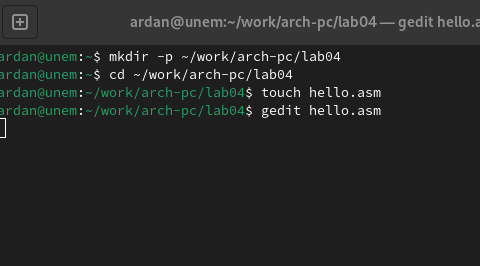
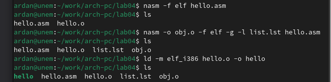
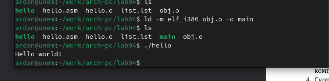
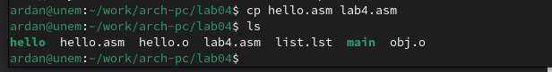
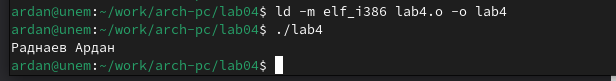

---
## Front matter
title: "Шаблон отчёта по лабораторной работе №4"
subtitle: "Простейший вариант"
author: "Раднаев Ардан Баирович"

## Generic otions
lang: ru-RU
toc-title: "Содержание"

## Bibliography
bibliography: bib/cite.bib
csl: pandoc/csl/gost-r-7-0-5-2008-numeric.csl

## Pdf output format
toc: true # Table of contents
toc-depth: 2
lof: true # List of figures
lot: true # List of tables
fontsize: 12pt
linestretch: 1.5
papersize: a4
documentclass: scrreprt
## I18n polyglossia
polyglossia-lang:
  name: russian
  options:
	- spelling=modern
	- babelshorthands=true
polyglossia-otherlangs:
  name: english
## I18n babel
babel-lang: russian
babel-otherlangs: english
## Fonts
mainfont: IBM Plex Serif
romanfont: IBM Plex Serif
sansfont: IBM Plex Sans
mathfont: STIX Two Math
mainfontoptions: Ligatures=Common,Ligatures=TeX,Scale=0.94
romanfontoptions: Ligatures=Common,Ligatures=TeX,Scale=0.94
sansfontoptions: Ligatures=Common,Ligatures=TeX,Scale=MatchLowercase,Scale=0.94
monofontoptions: Scale=MatchLowercase,Scale=0.94,FakeStretch=0.9
mathfontoptions:
## Biblatex
biblatex: true
biblio-style: "gost-numeric"
biblatexoptions:
  - parentracker=true
  - backend=biber
  - hyperref=auto
  - language=auto
  - autolang=other*
  - citestyle=gost-numeric
## Pandoc-crossref LaTeX customization
figureTitle: "Рис."
tableTitle: "Таблица"
listingTitle: "Листинг"
lofTitle: "Список иллюстраций"
lotTitle: "Список таблиц"
lolTitle: "Листинги"
## Misc options
indent: true
header-includes:
  - \usepackage{indentfirst}
  - \usepackage{float} # keep figures where there are in the text
  - \floatplacement{figure}{H} # keep figures where there are in the text
---

# Цель работы

Освоение процедуры компиляции и сборки программ, написанных на ассемблере NASM.

# Задание

1. Программа Hello world!

2. Задание для самостоятельной работы.

# Теоретическое введение

Чтобы создать заголовок, используйте знак #, например:
# This is heading 1
## This is heading 2
### This is heading 3
#### This is heading 4
Чтобы задать для текста полужирное начертание, заключите его в двойные звездочки:
This text is **bold**.
Чтобы задать для текста курсивное начертание, заключите его в одинарные звездочки:
This text is *italic*.
Чтобы задать для текста полужирное и курсивное начертание, заключите его в тройные
звездочки:
This is text is both ***bold and italic***.
Блоки цитирования создаются с помощью символа >:
> The drought had lasted now for ten million years, and the reign of the
terrible lizards had long since ended. Here on the Equator, in the
continent which would one day be known as Africa, the battle for existence
had reached a new climax of ferocity, and the victor was not yet in sight.
In this barren and desiccated land, only the small or the swift or the
fierce could flourish, or even hope to survive.
↪
↪
↪
↪
↪
Упорядоченный список можно отформатировать с помощью соответствующих цифр

1. First instruction
	1. Sub-instruction
	1. Sub-instruction
1. Second instruction
Чтобы вложить один список в другой, добавьте отступ для элементов дочернего списка:
1. 	First instruction
1. 	Second instruction
1. 	Third instruction
Неупорядоченный (маркированный) список можно отформатировать с помощью звездо-
чек или тире:
* List item 1
* List item 2
* List item 3
Чтобы вложить один список в другой, добавьте отступ для элементов дочернего списка:
- List item 1
- List item A
- List item B
- List item 2
Синтаксис Markdown для встроенной ссылки состоит из части [link text], представляю-
щей текст гиперссылки, и части (file-name.md) – URL-адреса или имени файла, на который
дается ссылка:
[link text](file-name.md)
или
[link text](http://example.com/ "Необязательная подсказка")
Markdown поддерживает как встраивание фрагментов кода в предложение, так и их разме-
щение между предложениями в виде отдельных огражденных блоков. Огражденные блоки
кода — это простой способ выделить синтаксис для фрагментов кода. Общий формат ограж-
денных блоков кода:
``` language
your code goes in here
```

# Выполнение лабораторной работы

Создайте каталог для работы с программами на языке ассемблера NASM:
mkdir -p ~/work/arch-pc/lab04

Перейдите в созданный каталог
cd ~/work/arch-pc/lab04

Создайте текстовый файл с именем hello.asm
touch hello.asm

откройте этот файл с помощью любого текстового редактора, например, gedit
gedit hello.asm

и введите в него следующий текст:

; hello.asm
SECTION .data ; Начало секции данных
hello: DB 'Hello world!',10 ; 'Hello world!' плюс
; символ перевода строки
helloLen: EQU $-hello ; Длина строки hello
SECTION .text ; Начало секции кода
GLOBAL _start
_start: ; Точка входа в программу
mov eax,4 ; Системный вызов для записи (sys_write)
mov ebx,1 ; Описатель файла '1' - стандартный вывод
mov ecx,hello ; Адрес строки hello в ecx
mov edx,helloLen ; Размер строки hello
int 80h ; Вызов ядра
mov eax,1 ; Системный вызов для выхода (sys_exit)
mov ebx,0 ; Выход с кодом возврата '0' (без ошибок)
int 80h ; Вызов ядра

NASM превращает текст программы в объектный код. Например, для компиляции приве-
дённого выше текста программы «Hello World» необходимо написать:
nasm -f elf hello.asm

Выполните следующую команду:
nasm -o obj.o -f elf -g -l list.lst hello.asm

Как видно из схемы на рис. 4.3, чтобы получить исполняемую программу, объектный файл
необходимо передать на обработку компоновщику:
ld -m elf_i386 hello.o -o hello

Выполните следующую команду:
ld -m elf_i386 obj.o -o main


Запустить на выполнение созданный исполняемый файл, находящийся в текущем каталоге,
можно, набрав в командной строке:
./hello


{#fig:fig1 width=70% }


{#fig:fig2 width=70% }


{#fig:fig3 width=70% }


{#fig:fig4 width=70% }


{#fig:fig5  width=70% }

Компилирую файл с отчетом. Загружаю отчет на GitHub.

1. В каталоге ~/work/arch-pc/lab04 с помощью команды cp создайте копию файла
hello.asm с именем lab4.asm
2. С помощью любого текстового редактора внесите изменения в текст программы в
файле lab4.asm так, чтобы вместо Hello world! на экран выводилась строка с вашими
фамилией и именем.
3. Оттранслируйте полученный текст программы lab4.asm в объектный файл. Выполните
компоновку объектного файла и запустите получившийся исполняемый файл.
4. Скопируйте файлы hello.asm и lab4.asm в Ваш локальный репозиторий в ката-
лог ~/work/study/2023-2024/"Архитектура компьютера"/arch-pc/labs/lab04/.
Загрузите файлы на Github.

# Выводы

Научился работать с NASM.

# Список литературы{.unnumbered}

[Архитектура ЭВМ](https://esystem.rudn.ru/pluginfile.php/1584625/mod_resource/content/1/%D0%9B%D0%B0%D0%B1%D0%BE%D1%80%D0%B0%D1%82%D0%BE%D1%80%D0%BD%D0%B0%D1%8F%20%D1%80%D0%B0%D0%B1%D0%BE%D1%82%D0%B0%20%E2%84%964.pdf)
