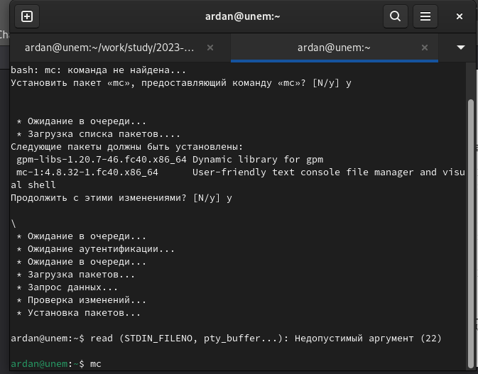
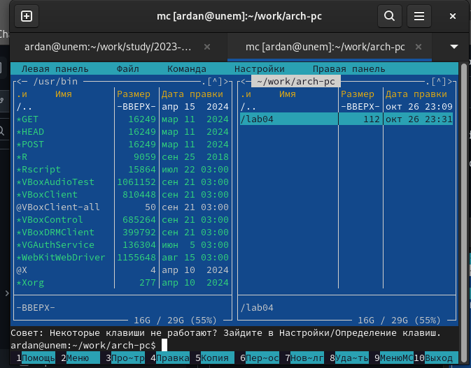
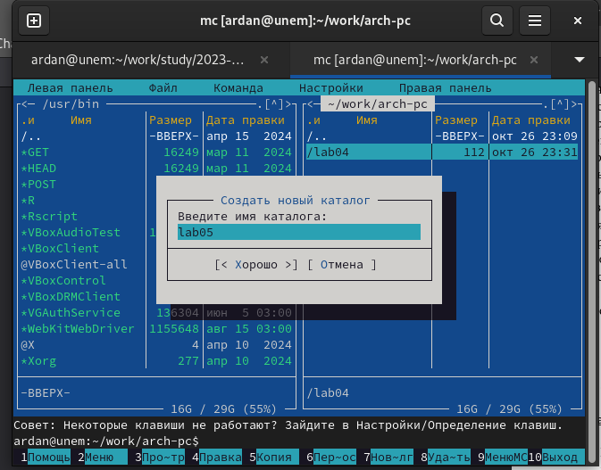
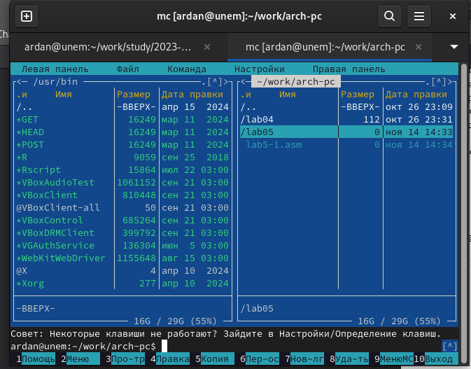
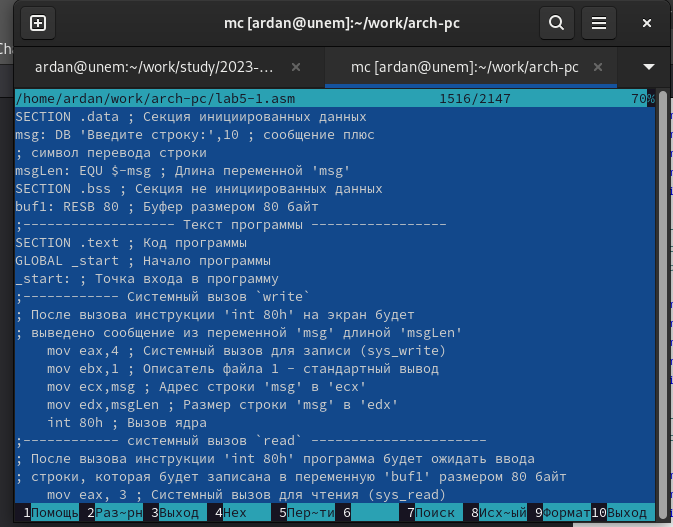
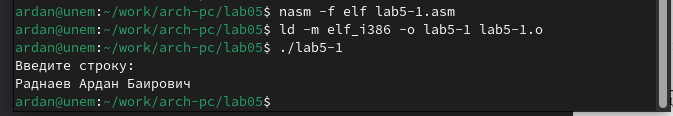
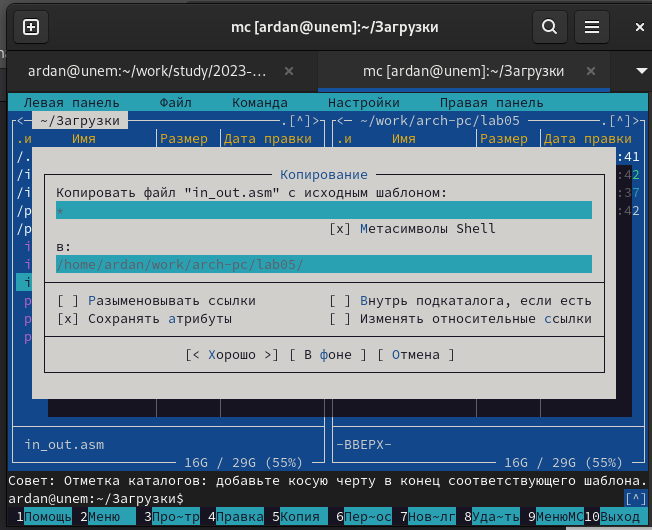
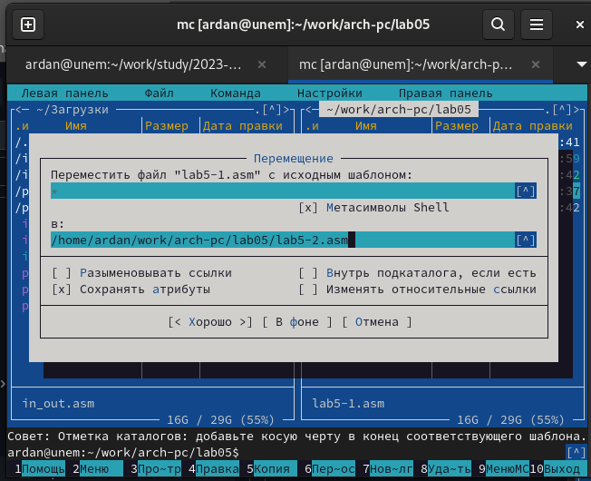
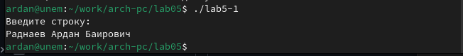
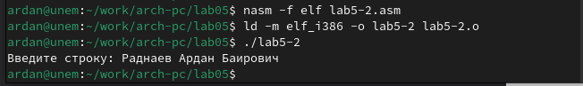

---
## Front matter
title: "Отчет по лабораторной работе #5"
subtitle: "Архитектура компьютера"
author: "Раднаев Ардан Баирович"

## Generic otions
lang: ru-RU
toc-title: "Содержание"

## Bibliography
bibliography: bib/cite.bib
csl: pandoc/csl/gost-r-7-0-5-2008-numeric.csl

## Pdf output format
toc: true # Table of contents
toc-depth: 2
lof: true # List of figures
lot: true # List of tables
fontsize: 12pt
linestretch: 1.5
papersize: a4
documentclass: scrreprt
## I18n polyglossia
polyglossia-lang:
  name: russian
  options:
	- spelling=modern
	- babelshorthands=true
polyglossia-otherlangs:
  name: english
## I18n babel
babel-lang: russian
babel-otherlangs: english
## Fonts
mainfont: IBM Plex Serif
romanfont: IBM Plex Serif
sansfont: IBM Plex Sans
monofont: IBM Plex Mono
mathfont: STIX Two Math
mainfontoptions: Ligatures=Common,Ligatures=TeX,Scale=0.94
romanfontoptions: Ligatures=Common,Ligatures=TeX,Scale=0.94
sansfontoptions: Ligatures=Common,Ligatures=TeX,Scale=MatchLowercase,Scale=0.94
monofontoptions: Scale=MatchLowercase,Scale=0.94,FakeStretch=0.9
mathfontoptions:
## Biblatex
biblatex: true
biblio-style: "gost-numeric"
biblatexoptions:
  - parentracker=true
  - backend=biber
  - hyperref=auto
  - language=auto
  - autolang=other*
  - citestyle=gost-numeric
## Pandoc-crossref LaTeX customization
figureTitle: "Рис."
tableTitle: "Таблица"
listingTitle: "Листинг"
lofTitle: "Список иллюстраций"
lotTitle: "Список таблиц"
lolTitle: "Листинги"
## Misc options
indent: true
header-includes:
  - \usepackage{indentfirst}
  - \usepackage{float} # keep figures where there are in the text
  - \floatplacement{figure}{H} # keep figures where there are in the text
---

# Цель работы

Приобретение практических навыков работы в Midnight Commander. Освоение инструкций
языка ассемблера mov и int.

# Задание

1. Основы работы с Midnight Commander
2. Структура программы на языке ассемблера NASM
3. Элементы программирования

# Теоретическое введение

Midnight Commander (или просто mc) — это программа, которая позволяет просматривать
структуру каталогов и выполнять основные операции по управлению файловой системой,
т.е. mc является файловым менеджером. Midnight Commander позволяет сделать работу с
файлами более удобной и наглядной.

# Выполнение лабораторной работы

1. Откройте Midnight Commande (рис. [-@fig:001]).
{#fig:001 width=70%}

2. Пользуясь клавишами ↑ , ↓ и Enter перейдите в каталог ~/work/arch-pc созданный
при выполнении лабораторной работы №4 (рис. [-@fig:002])
{#fig:002 width=70%}

3. С помощью функциональной клавиши F7 создайте папку lab05 и перейдите
в созданный каталог.(рис. [-@fig:003])
{#fig:003 width=70%}

4. Пользуясь строкой ввода и командой touch создайте файл lab5-1.asm (рис. [-@fig:004])
{#fig:004 width=70%}

5. С помощью функциональной клавиши F4 откройте файл lab5-1.asm для редактирования во встроенном редакторе. Как правило в качестве встроенного редактора Midnight
Commander используется редакторы nano или mcedit. Введите текст программы из листинга 5.1 (можно без комментариев), сохраните изменения и закройте файл. (рис. [-@fig:005])
{#fig:005 width=70%}

6. Оттранслируйте текст программы lab5-1.asm в объектный файл. Выполните компоновку объектного файла и запустите получившийся исполняемый файл. Программа выводит строку 'Введите строку:' и ожидает ввода с клавиатуры. На запрос введите Ваши ФИО.(рис. [-@fig:006])
{#fig:006 width=70%}

7. Скопируйте файл in_out.asm в каталог с файлом lab5-1.asm с помощью функциональной
клавиши F5 (рис. [-@fig:007])
{#fig:007 width=70%}

8. С помощью функциональной клавиши F6 создайте копию файла lab5-1.asm с именем
lab5-2.asm. Выделите файл lab5-1.asm, нажмите клавишу F6 , введите имя файла
lab5-2.asm и нажмите клавишу Enter (рис. [-@fig:008])
{#fig:008 width=70%}

9. Исправьте текст программы в файле lab5-2.asm с использование подпрограмм из
внешнего файла in_out.asm (используйте подпрограммы sprintLF, sread и quit) в
соответствии с листингом 5.2. Создайте исполняемый файл и проверьте его работу. 

10. В файле lab5-2.asm замените подпрограмму sprintLF на sprint. Создайте исполняе-
мый файл и проверьте его работу. В чем разница? (рис. [-@fig:009]) (рис. [-@fig:010])
{#fig:009 width=70%}
{#fig:010 width=70%}

# Выводы

По итогам лабораторной работы я научился работать с MC.

# Список литературы{.unnumbered}

::: {#refs}
:::
