---
## Front matter
title: "Отчет по лабораторной работе №6"
subtitle: "Архитектура компьютера"
author: "Раднаев Ардан Баирович"

## Generic otions
lang: ru-RU
toc-title: "Содержание"

## Bibliography
bibliography: bib/cite.bib
csl: pandoc/csl/gost-r-7-0-5-2008-numeric.csl

## Pdf output format
toc: true # Table of contents
toc-depth: 2
lof: true # List of figures
lot: true # List of tables
fontsize: 12pt
linestretch: 1.5
papersize: a4
documentclass: scrreprt
## I18n polyglossia
polyglossia-lang:
  name: russian
  options:
	- spelling=modern
	- babelshorthands=true
polyglossia-otherlangs:
  name: english
## I18n babel
babel-lang: russian
babel-otherlangs: english
## Fonts
mainfont: IBM Plex Serif
romanfont: IBM Plex Serif
sansfont: IBM Plex Sans
monofont: IBM Plex Mono
mathfont: STIX Two Math
mainfontoptions: Ligatures=Common,Ligatures=TeX,Scale=0.94
romanfontoptions: Ligatures=Common,Ligatures=TeX,Scale=0.94
sansfontoptions: Ligatures=Common,Ligatures=TeX,Scale=MatchLowercase,Scale=0.94
monofontoptions: Scale=MatchLowercase,Scale=0.94,FakeStretch=0.9
mathfontoptions:
## Biblatex
biblatex: true
biblio-style: "gost-numeric"
biblatexoptions:
  - parentracker=true
  - backend=biber
  - hyperref=auto
  - language=auto
  - autolang=other*
  - citestyle=gost-numeric
## Pandoc-crossref LaTeX customization
figureTitle: "Рис."
tableTitle: "Таблица"
listingTitle: "Листинг"
lofTitle: "Список иллюстраций"
lotTitle: "Список таблиц"
lolTitle: "Листинги"
## Misc options
indent: true
header-includes:
  - \usepackage{indentfirst}
  - \usepackage{float} # keep figures where there are in the text
  - \floatplacement{figure}{H} # keep figures where there are in the text
---

# Цель работы

Освоение арифметических инструкций языка ассемблера NASM.

# Задание

1. Символьные и численные данные в NASM
2. Выполнение арифметических операций в NASM
3. Выполнение заданий для самостоятельной работы

# Теоретическое введение

Большинство инструкций на языке ассемблера требуют обработки операндов. Адрес операнда предоставляет место, где хранятся данные, подлежащие обработке. Это могут быть данные хранящиеся в регистре или в ячейке памяти. Далее рассмотрены все существующие способы задания адреса хранения операндов – способы адресации.
Существует три основных способа адресации:
• Регистровая адресация – операнды хранятся в регистрах и в команде используются
имена этих регистров, например: mov ax,bx.
• Непосредственная адресация – значение операнда задается непосредственно в ко-
манде, Например: mov ax,2.
• Адресация памяти – операнд задает адрес в памяти. В команде указывается символи-
ческое обозначение ячейки памяти, над содержимым которой требуется выполнить
операцию.

# Выполнение лабораторной работы

1. Создайте каталог для программам лабораторной работы № 6, перейдите в него и создайте файл lab6-1.asm: (рис. [-@fig:001]).

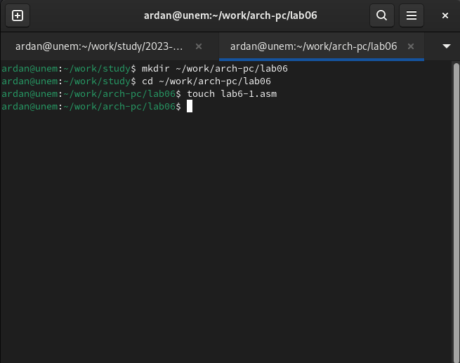{#fig:001 width=70%}

2. Введите в файл lab6-1.asm текст программы из листинга 6.1. В данной программе в регистр eax записывается символ 6 (mov eax,'6'), в регистр ebx символ 4 (mov ebx,'4').
Далее к значению в регистре eax прибавляем значение регистра ebx (add eax,ebx, ре-
зультат сложения запишется в регистр eax). Далее выводим результат. Так как для работы
функции sprintLF в регистр eax должен быть записан адрес, необходимо использовать до-
полнительную переменную. Для этого запишем значение регистра eax в переменную buf1
(mov [buf1],eax), а затем запишем адрес переменной buf1 в регистр eax (mov eax,buf1) и
вызовем функцию sprintLF (рис. [-@fig:002]). (рис. [-@fig:003]).
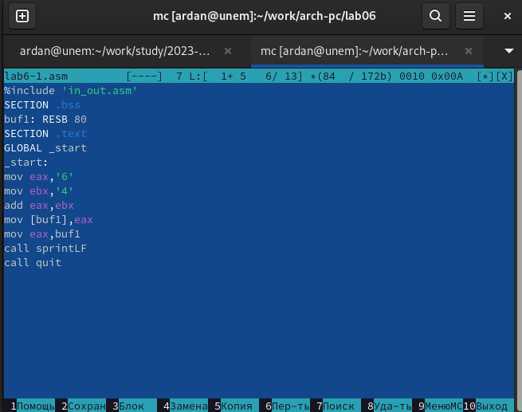{#fig:002 width=70%}
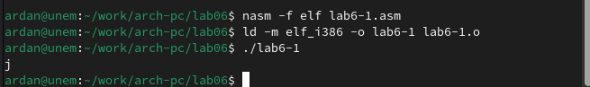{#fig:003 width=70%}
3. Далее изменим текст программы и вместо символов, запишем в регистры числа. Исправьте текст программы (Листинг 6.1) следующим образом: замените строки

mov eax,'6'
mov ebx,'4'

на строки

mov eax,6
mov ebx,4

Создайте исполняемый файл и запустите его. (рис. [-@fig:004]).
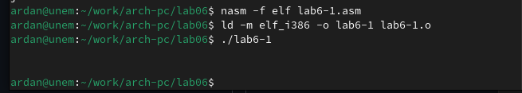{#fig:004 width=70%}
На этот раз программа выдала пустую строчку, потому что символ 10 означает переход на новую строку

4. Создайте файл lab6-2.asm в каталоге ~/work/arch-pc/lab06 и введите в него текст про-
граммы из листинга 6.2. (рис. [-@fig:005]).
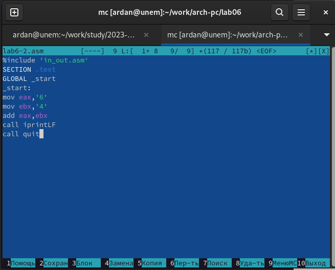{#fig:005 width=70%}

В результате работы программы мы получим число 106.(рис. [-@fig:006]).
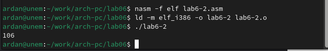{#fig:006 width=70%}
Аналогично предыдущему примеру изменим символы на числа. Замените строки

mov eax,'6'
mov ebx,'4'

на строки

mov eax,6
mov ebx,4

Создайте исполняемый файл и запустите его. Какой результат будет получен при исполнении программы? 
Получилось число 10. (рис. [-@fig:007]).
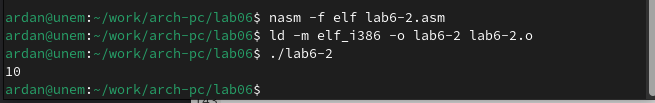{#fig:007 width=70%}

Замените функцию iprintLF на iprint. Создайте исполняемый файл и запустите его. Чем отличается вывод функций iprintLF и iprint?
Заменив функцию вывода на iprint, я получаю тот же результат, но без переноса строки (рис. [-@fig:008]).
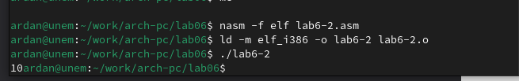{#fig:008 width=70%}

5. В качестве примера выполнения арифметических операций в NASM приведем программу вычисления арифметического выражения 𝑓(𝑥) = (5 ∗ 2 + 3)/3. (рис. [-@fig:009]).
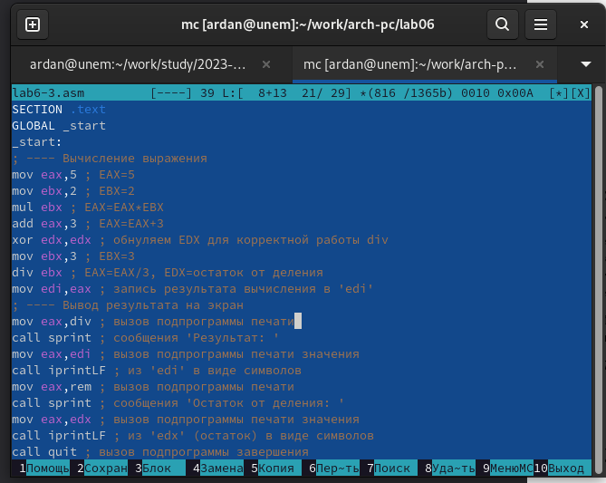{#fig:009 width=70%}
Создайте файл lab6-3.asm в каталоге ~/work/arch-pc/lab06: 

Cоздайте исполняемый файл и запустите его. Результат работы программы должен быть следующим:
user@dk4n31:~$ ./lab6-3
Результат: 4
Остаток от деления: 1
user@dk4n31:~$
(рис. [-@fig:010]).
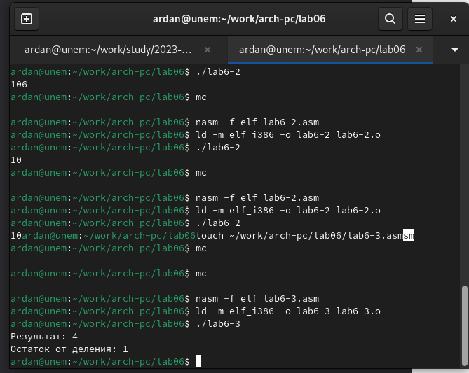{#fig:010 width=70%}
Измените текст программы для вычисления выражения 𝑓(𝑥) = (4 ∗ 6 + 2)/5. Создайте исполняемый файл и проверьте его работу. (рис. [-@fig:011]).
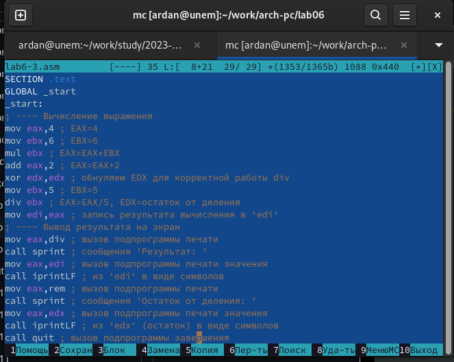{#fig:011 width=70%}

(рис. [-@fig:012]).
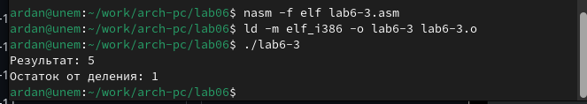{#fig:012 width=70%}

6. В качестве другого примера рассмотрим программу вычисления варианта задания по
номеру студенческого билета, работающую по следующему алгоритму:
• вывести запрос на введение № студенческого билета
• вычислить номер варианта по формуле: (𝑆𝑛 mod 20) + 1, где 𝑆𝑛 – номер студен-
ческого билета (В данном случае 𝑎 mod 𝑏 – это остаток от деления 𝑎 на 𝑏).
• вывести на экран номер варианта.


Создайте файл variant.asm в каталоге ~/work/arch-pc/lab06
Внимательно изучите текст программы из листинга 6.4 и введите в файл variant.asm.
Создайте исполняемый файл и запустите его. Проверьте результат работы программы вычислив номер варианта аналитически.

(рис. [-@fig:013]).
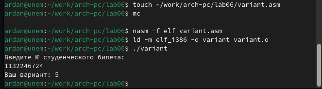{#fig:013 width=70%}

toc-title: Ответы на вопросы:
1.За вывод сообщения “Ваш вариант” отвечают строки кода:

mov eax,rem
call sprint

2.Инструкция mov ecx, x используется, чтобы положить адрес вводимой строки x в регистр ecx mov edx, 80 - запись в регистр edx длины вводимой строки call sread - вызов подпрограммы из внешнего файла, обеспечивающей ввод сообщения с клавиатуры.

3.сall atoi используется для вызова подпрограммы из внешнего файла, которая преобразует ascii-код символа в целое число и записывает результат в регистр eax.

4.За вычисления варианта отвечают строки:

xor edx,edx ; обнуление edx для корректной работы div
mov ebx,20 ; ebx = 20
div ebx ; eax = eax/20, edx - остаток от деления
inc edx ; edx = edx + 1

5.При выполнении инструкции div ebx остаток от деления записывается в регистр edx.

6.Инструкция inc edx увеличивает значение регистра edx на 1.

7.За вывод на экран результатов вычислений отвечают строки:

mov eax,edx
call iprintLF

toc-title:Задание для самостоятельной работы

Написать программу вычисления выражения 𝑦 = 𝑓(𝑥). Программа должна выводить
выражение для вычисления, выводить запрос на ввод значения 𝑥, вычислять задан-
ное выражение в зависимости от введенного 𝑥, выводить результат вычислений. Вид
функции 𝑓(𝑥) выбрать из таблицы 6.3 вариантов заданий в соответствии с номером
полученным при выполнении лабораторной работы. Создайте исполняемый файл и
проверьте его работу для значений 𝑥1 и 𝑥2 из 6.3

Буду выполнять задание для 5-го варианта (9𝑥 − 8)/8

Код программы:

```NASM
%include 'in_out.asm'
SECTION .data
msg: DB 'Введите значение переменной x: ',0
rem: DB 'Результат: ',0
SECTION .bss
x: RESB 80
SECTION .text
GLOBAL _start
_start:
mov eax, msg
call sprint
mov ecx, x
mov edx, 80
call sread
mov eax,x
call atoi
mov ebx, 9
mul ebx
sub eax, 8
mov ebx, 8
div ebx
mov edi, eax
mov eax,rem
call sprint
mov eax,edx
call iprintLF
call quit
```

# Выводы

По итогам Лабораторной работы я научился работать с алгебраичесскими функциями в NASM

# Список литературы{.unnumbered}

::: {#refs}
:::
